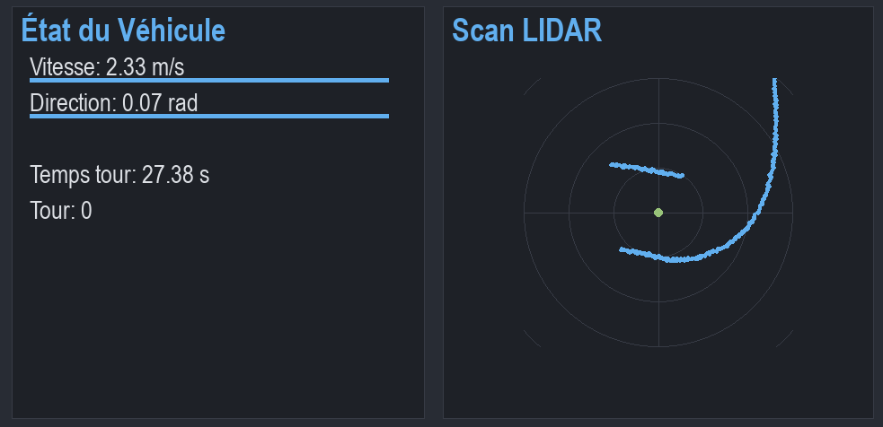
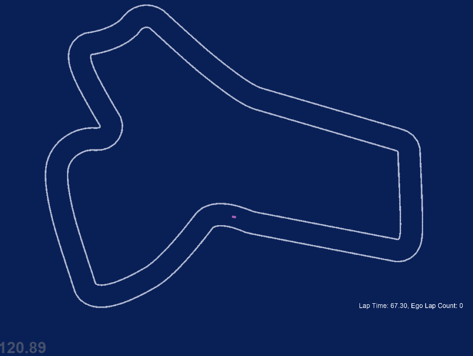

[TOC]


# F1TENTH Optimization

Ce projet implémente un système d'optimisation des paramètres pour un véhicule F1TENTH utilisant l'algorithme Nelder-Mead et une exploration adaptative.
On utilise un simulateur (F1tenth_gym), un algoritme de navigation et un optimizer de paramatre


## Interfaces

### Interface de Simulation
La fenêtre principale de simulation montre la vue de dessus du circuit et le véhicule :



### Interface de Télémétrie
L'interface de télémétrie affiche en temps réel les informations du véhicule :



- **État du Véhicule** (panneau gauche) :
  - Vitesse et direction avec barres de progression
  - Temps au tour actuel
  - Meilleur temps au tour
  - Nombre de tours complétés

- **Scan LIDAR** (panneau droit) :
  - Visualisation en temps réel des données LIDAR
  - Grille de référence avec distances
  - Position du véhicule au centre

Les deux interfaces fonctionnent en parallèle pendant l'optimisation, permettant de suivre à la fois la position du véhicule sur le circuit et ses données en temps réel.

## Modes de Fonctionnement

### 1. Mode Optimisation Automatique
Le mode principal qui optimise les paramètres du contrôleur autonome.

### 2. Mode Téléopération
Pour basculer en téléopération manuelle :
```python
# Dans main.py, modifier la ligne :
controller = SimpleAutonomousController(**params)
# Par :
controller = TeleoperationController()
```

Contrôles en téléopération :
- Flèches Haut/Bas : Accélération/Freinage
- Flèches Gauche/Droite : Direction
- 'R' : Reset de la position
- 'Échap' : Quitter

## Algorithme de Navigation

Le contrôleur autonome (`SimpleAutonomousController`) utilise une approche basée sur les capteurs LIDAR avec les composants suivants :

### 1. Détection d'Obstacles
```python
{
    'front_angle': angle de détection avant,
    'side_angle': angle de détection latérale,
    'min_front_dist': distance minimale avant,
    'safety_margin': marge de sécurité
}
```

### 2. Logique de Contrôle
- Détection de la direction optimale basée sur les données LIDAR
- Ajustement dynamique de la vitesse selon la courbure
- Évitement d'obstacles avec marges de sécurité adaptatives
- Gestion des virages avec ralentissement automatique

### 3. Paramètres Optimisés
Les six paramètres clés qui influencent le comportement :
- `max_speed` : Vitesse maximale en ligne droite
- `max_steer` : Angle de braquage maximum
- `min_front_dist` : Distance minimale de sécurité avant
- `safety_margin` : Marge de sécurité générale
- `front_angle` : Angle de détection avant
- `side_angle` : Angle de détection latérale

## Système d'Optimisation

### Paramètres Optimisés

```python
{
    'max_speed': 1.0 à 3.0 m/s,
    'max_steer': 0.05 à 0.2 rad,
    'min_front_dist': 0.1 à 1.0 m,
    'safety_margin': 0.2 à 0.4 m,
    'front_angle': 10 à 45 degrés,
    'side_angle': 10 à 110 degrés
}
```

### Algorithme d'Optimisation

1. **Phase Initiale** :
   - Démarrage avec les valeurs moyennes
   - Collecte de données pour 10 premiers tests

2. **Optimisation Nelder-Mead** :
   - Activation après 10 tests
   - Utilisation d'un simplexe initial adaptatif (10% de la plage des paramètres)
   - 200 itérations maximum
   - 300 évaluations maximum

3. **Stratégie d'Exploration** :
   - 80% Exploitation (Nelder-Mead avec bruit adaptatif)
   - 20% Exploration aléatoire

### Système de Score

Le score est calculé selon les critères suivants :

1. **Collision** : -1000 points
2. **Tour Non Complété** : -1000 points + distance parcourue
3. **Tour Complété** : 10000 points - (temps × 10)

Cette échelle assure que :
- Un tour complet est toujours mieux qu'un tour incomplet
- Les collisions sont fortement pénalisées
- La vitesse est récompensée pour les tours complets

### Affichage en Temps Réel

L'interface affiche :
- État de l'optimisation Nelder-Mead
- Nombre d'itérations
- Meilleur score trouvé
- Mode actuel (exploitation/exploration)
- Échelle du bruit adaptatif

### Sauvegarde des Résultats

Les résultats sont sauvegardés dans un fichier CSV avec :
- Paramètres testés
- Temps total
- Distance parcourue
- État de collision
- Complétion du tour
- Temps au tour
- Score final

## Configuration de l'environnement F1TENTH Gym

Ce guide détaille les étapes pour configurer correctement l'environnement de simulation F1TENTH Gym.

### Prérequis

- Windows 10 ou plus récent
- Python 3.8 (spécifiquement cette version)
- Git

### Installation étape par étape

1. **Créer un environnement virtuel Python**
   ```powershell
   # Créer un nouvel environnement virtuel
   py -3.8 -m venv f1tenth_env
   
   # Activer l'environnement
   .\f1tenth_env\Scripts\activate
   ```

2. **Mettre à jour pip à une version spécifique**
   ```powershell
   python -m pip install pip==21.3.1
   ```

3. **Installer les dépendances (2 méthodes possibles)**
   ```powershell
   # Installer à partir du fichier requirements.txt
   pip install -r requirements.txt
   ```

4. **Cloner et installer F1TENTH Gym**
   ```powershell
   # Cloner le dépôt
   git clone https://github.com/f1tenth/f1tenth_gym.git
   cd f1tenth_gym
   
   # Installer en mode développement
   pip install -e . --> si marche pas
   ```

### Vérification de l'installation

Pour vérifier que tout fonctionne correctement :

1. **Tester l'exemple de base**
   ```powershell
   cd examples
   python waypoint_follow.py
   ```
   Une fenêtre devrait s'ouvrir montrant la simulation.

### Utilisation

Pour lancer l'optimisation :
```bash
python main.py
```

L'optimisation peut être interrompue à tout moment avec Ctrl+C, affichant les meilleurs paramètres trouvés.
